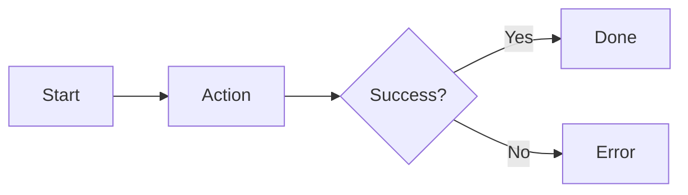

# /ux — Generate UX Spec from PRD

## Goal
Generate `artifacts/02-ux.md` with flows, states, and interactions.

## Workflow Position
```
/brief → /prd → Oracle → [/ux] → Oracle Convergence → /plan → ...
                         ^^^^^
                       YOU ARE HERE
```

## Prerequisites
- `artifacts/01-prd.md` must exist
- PRD should have converged (0 blockers/majors)

---

## ⚠️ CHECK EXISTING STATE FIRST

**Before generating, check what already exists:**

```bash
# Check if UX spec already exists
ls -la artifacts/02-ux.md 2>/dev/null

# Check PRD convergence (prerequisite)
cat artifacts/06-oracle/prd/convergence-history.json 2>/dev/null

# Check UX Oracle state
cat artifacts/06-oracle/ux/convergence-history.json 2>/dev/null

# Check for unapplied UX feedback
ls -t artifacts/06-oracle/ux/*.md 2>/dev/null | head -3
```

| Situation | Action |
|-----------|--------|
| PRD not converged | → Run `/oracle prd` first |
| No UX spec exists | → Generate it (this command) |
| UX exists, no Oracle feedback | → Run Oracle convergence |
| UX exists, unapplied Oracle feedback | → Apply feedback first |
| UX converged (0 blockers, ≤2 majors) | → Skip to `/plan` |

---

## What This Command Does
1. Reads the PRD
2. Generates UX specification
3. Writes to `artifacts/02-ux.md`
4. **AUTO-LAUNCHES Oracle convergence** (unless --no-oracle flag)

## Steps

### 1. Read PRD
Extract user stories, requirements, design considerations.

### 2. Generate UX Spec
Create `artifacts/02-ux.md` with:
- Design Direction & Principles
- **User Journeys with E2E tests** (mark happy paths with ⭐)
- Primary Flows (step-by-step with success/error paths)
- Screen Inventory
- State Matrix (Loading, Empty, Error, Success, Partial)
- Validation & Copy Rules
- Accessibility Requirements
- Responsive Breakpoints

### 2a. User Journeys (CRITICAL)
For each major user goal, document:
```markdown
### UJ-001: [Journey Name] ⭐ HAPPY PATH
**Goal:** What user wants to accomplish
**Priority:** P0/P1/P2

**Steps:**
1. User [action] → Sees [result]
2. User [action] → Sees [result]

**E2E Test (agent-browser):**
```bash
agent-browser open http://localhost:3000
agent-browser click @e2
agent-browser wait --text "Success"
```
```

Happy paths (⭐) will be tested on every build via `/gates`.
- Interaction Patterns

### 3. Include Mermaid Diagrams


### 4. AUTO-LAUNCH Oracle Convergence

After generating the UX spec, **run the Oracle convergence script directly**:

```bash
./scripts/oracle_converge.sh ux artifacts/02-ux.md artifacts/01-prd.md
```

**DO NOT ask the user to run this. Just run it.**

The script will auto-open Chromium, run GPT-5.2 Pro review (30-90 min per pass), and iterate until convergence.

### 5. After Convergence: AUTO-CHAIN to /plan

When the Oracle convergence script finishes for UX (0 blockers), **automatically continue to /plan**:

```
✅ UX converged! (0 blockers, 0 majors)

🔄 Auto-continuing to implementation plan...
```

Then generate the plan and launch Oracle for plan review.

## Full Auto-Chain Flow

If user says `/ux` (or `/ux --auto`):
1. Generate UX spec → artifacts/02-ux.md
2. Run `./scripts/oracle_converge.sh ux` → wait for convergence
3. Generate Plan → artifacts/03-plan.md  
4. Run `./scripts/oracle_converge.sh plan` → wait for convergence
5. Generate task graph → artifacts/04-task-graph.json
6. Run `./scripts/ralph.sh --fresh-eyes 100` (autonomous implementation)

## Skip Oracle (Manual Mode)

If user explicitly says `/ux --no-oracle`:
1. Generate UX spec only
2. Skip Oracle automation (user chose to run it manually later)
