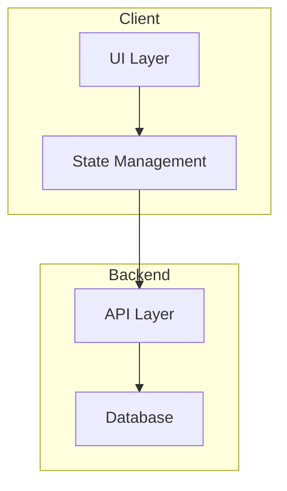

# 03 — Implementation Plan

## Architecture Overview

### System Diagram


### Modules/Components
| Module | Responsibility | Dependencies |
|--------|---------------|--------------|
| … | … | … |

### Data Model
```typescript
interface Entity {
  id: string;
  // ...
}
```

### API Contracts (if any)
- `POST /api/...` — …
- `GET /api/...` — …

## Test Strategy

### Test Layers
| Layer | Scope | Location | Written |
|-------|-------|----------|---------|
| Unit | Individual functions/classes | `*.test.ts` next to source | With feature (TDD) |
| Integration | API contracts, module interactions | `tests/integration/` | Separate bead |
| E2E | Full user flows | `e2e/` | Separate bead |

### Unit Test Contracts (TDD - per module)
For each module, define the test contract that agents write FIRST:

**Module: [name]**
```typescript
describe('[ModuleName]', () => {
  it('[expected behavior]')
  it('[edge case]')
  it('[error handling]')
})
```

### Integration Test Contracts
| Component A | Component B | Contract | Test |
|-------------|-------------|----------|------|
| Form | API | onSubmit calls createItem() | form-api.test.ts |
| API | Store | success updates items array | api-store.test.ts |

### E2E Scenarios (from PRD acceptance criteria)
| User Story | Scenario | Expected | Priority |
|------------|----------|----------|----------|
| … | … | … | P1 |

### Async Communication Testing (if using Workers/IPC)

If your architecture uses Web Workers, Service Workers, or similar async message passing:

**Required Test Coverage:**
| Test Type | What to Verify | Location |
|-----------|----------------|----------|
| Unit (Client) | Correlation ID matching | `lib/*.test.ts` |
| Unit (Worker) | Message handling logic | `worker/*.test.ts` |
| Integration | Request-response round-trip | `tests/integration/` |
| E2E | Full app with real worker | `e2e/` |

**Mandatory Patterns:**
- [ ] All request-response messages use correlation IDs
- [ ] Broadcasts are distinguished from responses
- [ ] Worker initialization includes ready handshake
- [ ] Tests verify broadcasts don't interfere with responses

See: `docs/WORKER_CLIENT_PATTERNS.md`

### Test Quality Requirements (Agent Evals)

**TDD Discipline (MANDATORY for agents):**
1. Write failing test FIRST - captures expected behavior
2. Verify it fails for the RIGHT reason - not a syntax error
3. Implement minimum code to pass
4. Keep tests green incrementally

**Deterministic Tests (prefer these):**
- Build passes/fails
- TypeScript compiles
- JSON schema validation
- File existence checks
- Import resolution

**Outcome-Based Tests (grade results, not paths):**
- Does the component render?
- Does the API return expected data?
- Does the feature work end-to-end?

**Avoid:**
- Writing code before tests
- Testing exact implementation steps
- Over-mocking that hides real integration issues
- Tests that pass when the app doesn't actually work

See: `docs/AGENT_EVALUATION.md`

## Key Technical Decisions

### Decision 1: [Topic]
- **Choice**: …
- **Why**: …
- **Alternatives**: …
- **Trade-offs**: …

### Decision 2: [Topic]
…

## Risks & Mitigations

| Risk | Likelihood | Impact | Mitigation |
|------|------------|--------|------------|
| … | Medium | High | … |

## Task Seeds

### Task Atomicity Principles (from jdrhyne/planner)

Each task MUST be:
- **Atomic and committable** — small, independent pieces of work
- **Specific and actionable** — not vague
- **Testable** — include verification method
- **Located** — include file paths

**❌ Bad Task:**
- [ ] <auth> :: Implement Google OAuth

**✅ Good Tasks (broken down):**
- [ ] <auth,config> :: Add Google OAuth environment variables
- [ ] <auth,deps> :: Install passport-google-oauth20 package
- [ ] <auth,api> :: Create OAuth callback route handler
- [ ] <auth,ui> :: Add Google sign-in button to login page

### Sprint Structure

Each sprint must:
- Result in a **demoable, runnable, testable increment**
- Build on prior sprint work
- Include **demo/validation checklist**
- **End with an INTEGRATION task** that verifies the sprint's work compiles and integrates

Use this **exact format** (parsed by task compiler):

### Sprint 1: [Sprint Name]

**Goal**: [What this sprint accomplishes]

**Demo/Validation**:
- [ ] How to run/demo this sprint's output
- [ ] What to verify

**Tasks**:

- [ ] <tag1,tag2> :: Task subject here
      - Description: What needs to be done
      - Deliverable: What artifact is produced
      - Files: src/path/file.ts, src/other/file.ts
      - Allowed paths: src/path/*, src/other/*
      - Unit Test Specs: (for feature tasks) List specific tests to write first
      - Verification: npm run test (or other command)
      - Complexity: 1-10 (perceived difficulty)
      - DependsOn: (optional) S1-T1, S1-T2

### Example Sprint:

### Sprint 1: Core Foundation

**Goal**: Setup project structure and core types

**Demo/Validation**:
- [ ] `npm run dev` starts without errors
- [ ] TypeScript compiles with no errors
- [ ] Core types are importable

**Tasks**:

- [ ] <setup,core> :: Initialize project structure
      - Description: Create Vite + React + TypeScript scaffold
      - Deliverable: package.json, tsconfig.json, vite.config.ts
      - Files: package.json, tsconfig.json, vite.config.ts
      - Allowed paths: /
      - Verification: npm run dev starts
      - Complexity: 2

- [ ] <core,types> :: Define core data types
      - Description: Create TypeScript interfaces for database, table, column
      - Deliverable: src/types/index.ts with Database, Table, Column types
      - Files: src/types/index.ts
      - Allowed paths: src/types/*
      - Unit Test Specs: isDatabase() returns true for valid db; isTable() validates required fields; serialization round-trips correctly
      - Verification: npm run test -- types && tsc --noEmit
      - Complexity: 3
      - DependsOn: S1-T1

- [ ] <integration,verify> :: Sprint 1 Integration Verification
      - Description: Verify all Sprint 1 work compiles and integrates correctly. Run full build, typecheck, and tests.
      - Deliverable: All gates passing
      - Files: (none - verification only)
      - Allowed paths: /
      - Verification: npm run typecheck && npm run build && npm run test
      - Complexity: 1
      - DependsOn: S1-T1, S1-T2
      - Note: MANDATORY - every sprint must end with an integration task

### Integration Task Template

**IMPORTANT**: Every sprint MUST end with an integration verification task:

\`\`\`markdown
- [ ] <integration,verify> :: Sprint N Integration Verification
      - Description: Verify all Sprint N work compiles and integrates correctly
      - Deliverable: All gates passing, no TypeScript errors, build succeeds
      - Files: (none - verification only)
      - Allowed paths: /
      - Verification: npm run typecheck && npm run build && npm run test
      - Complexity: 1
      - DependsOn: [all other tasks in this sprint]
\`\`\`

This catches:
- Type mismatches between components
- Missing props or incorrect interfaces
- Import errors
- Build-time errors that dev mode misses

## Verification Plan

### Local Development
```bash
npm install
npm run dev
```

### Build Verification (MANDATORY after every task)
```bash
# These MUST pass before any task is considered complete
npm run lint         # Catch code quality issues
npm run typecheck    # Catch type errors
npm run build        # Catch build errors
npm run test         # Catch regressions
```

### ❌ Forbidden Anti-Patterns
DO NOT do any of the following to "pass" verification:
- Disable lint rules (adding `'off'` to eslint config)
- Increase `max-warnings` to hide errors
- Weaken TypeScript config (`skipLibCheck`, disable strict)
- Skip or mock failing tests

Fix the root cause instead!

### E2E Flows to Test
1. [ ] User can [primary action]
2. [ ] User can [secondary action]
3. [ ] Error states display correctly

### Regression Checklist
- [ ] `npm run typecheck` passes (0 errors)
- [ ] `npm run build` succeeds
- [ ] All unit tests pass
- [ ] All E2E tests pass
- [ ] No console errors
- [ ] Bundle size < X KB

### Integration Checkpoints
After each sprint, verify:
- [ ] All components render without errors
- [ ] No missing props or type mismatches
- [ ] All imports resolve correctly
- [ ] App loads and basic functionality works

## Rollout Plan
- **Feature flags**: …
- **Monitoring**: …
- **Rollback**: …

## Open Questions
- …
